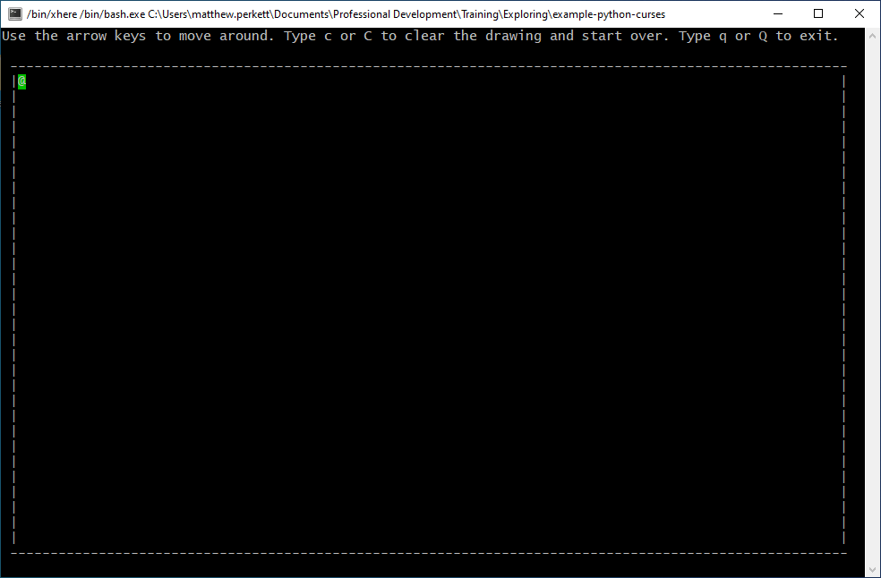
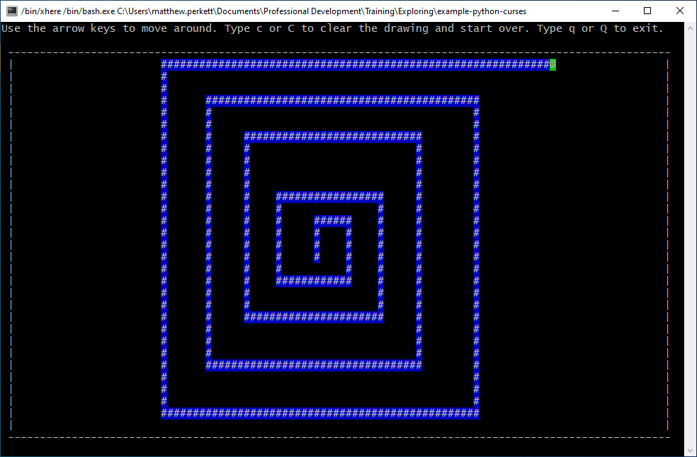

# Summary
An example using Python's `curses` module to implement an Etch A Sketch in the terminal.

**Initial Screen** - cursor location shown in green


**After drawing** - cursor path shown in blue with current cursor location in green (colors are easily customizable)


# Setup and Running
```
git clone https://github.com/mrperkett/example-python-curses.git example-python-curses
cd example-python-curses/
pyenv local 3.6.8

python3 ./drawWithCursor.py
```

# Thoughts

- It wouldn't be too difficult to modify this as an interactive [Logo](https://en.wikipedia.org/wiki/Logo_(programming_language))-like application where you can pick up and set down the pen, change colors, etc.
